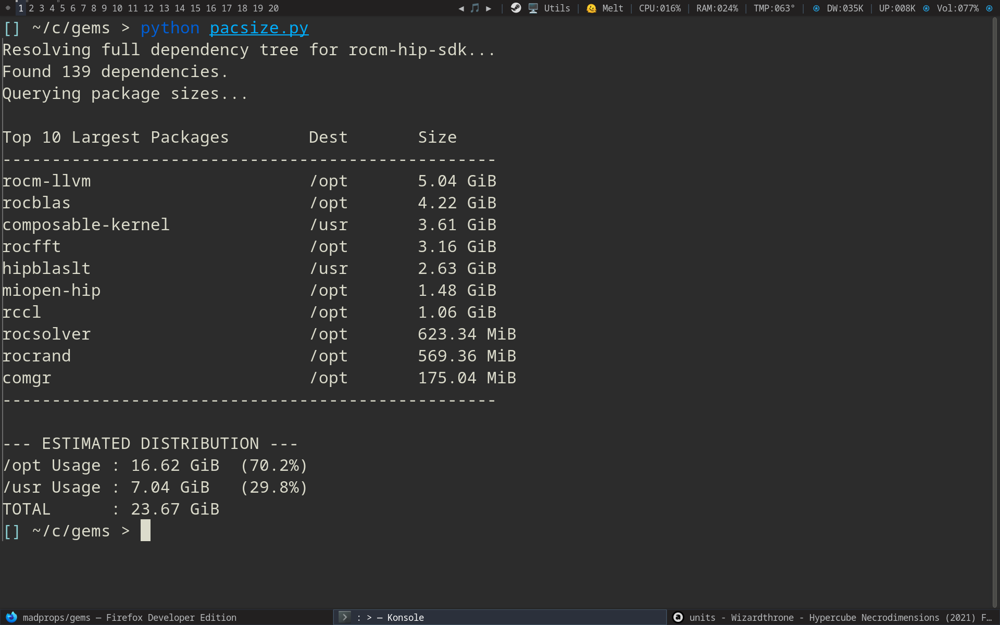

## pacsize.py

Prompt: ```
it is a metapackage yes. make a python or ruby script that will read all the entries in that metapackage and then check where each file is going to be installed and give a summary per main subdir for example /opt or /usr ... for instance "/opt = 10gb" "/usr = 1gb" .. to get an idea of where everything is going to be installed```

